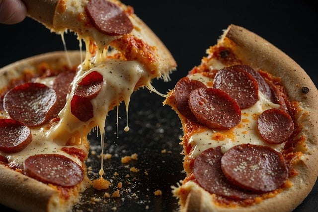

# menu
# treść
# pizze klasyczne

|Lp.|Pizza:                                                   |rozmiar: |30cm |50cm |60cm |
|---|---------------------------------------------------------|---------|-----|-----|-----|
|1. |MARGHERRITA (SOS, OREGANO, SER)                          |         |20zł |25zl |30zl |
|2. |FUNGHI (SOS POMIDOROWY, SER, PIECZARKI)                  |         |     |     |     |
|3. |SALAMI (SOS POMIDOROWY, SER GOUDA, SALAMI)               |         |     |     |     |
|4. |VESUWIO (sos pomidorowy, podwójny ser, szynka)           |         |     |     |     |
|5. |MILANO (oregano, sos ppmidorowy, papryka, szynka)        |         |     |     |     |

##pizze wegetariańskie
|4. |hawajska vege (sos pomidorowy, podwójny ser, )           |         |     |     |     |
|5. |MILANO wege (oregano, sos ppmidorowy, papryka,  )        |         |     |     |     |

## dodatki
cukinia - 5zł
karczochy - 6zł
krewetki - 10zł
